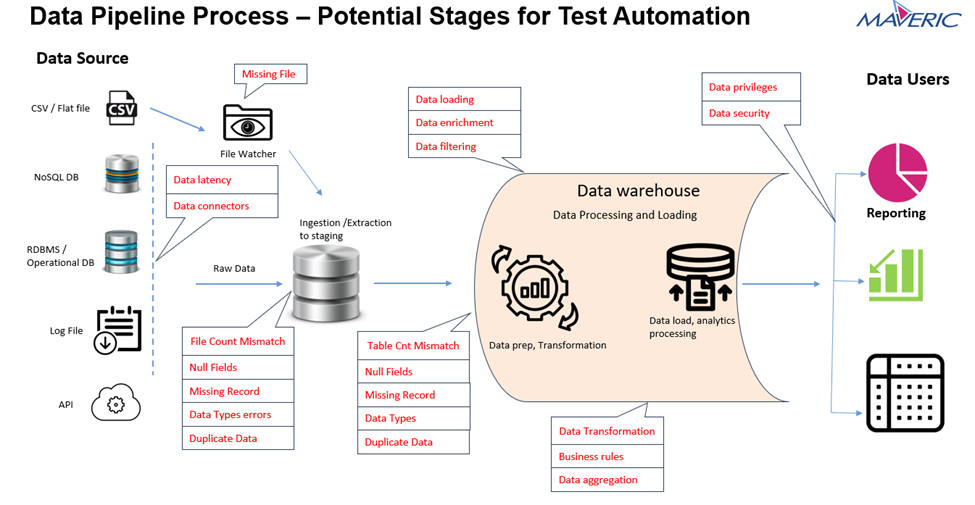

# Data-Pipeline

Objective: - A characteristic of data pipeline development is the frequent release of high-quality data to gain user feedback and acceptance. At the end of every data pipeline iteration, it’s expected that the data is of high quality for the next phase. Automated testing is essential for the integration testing of data pipelines.
What and when to automate (or even if you need automation) are crucial decisions for the test (or development) team. The selection of suitable product characteristics for automation largely determines the success of automation. 
Problem Statement: - 
First, it takes too long and is a critical inhibitor to the frequent delivery of pipelines. Teams that rely primarily on manual testing end up postponing testing to dedicated testing periods, allowing bugs to accumulate. 
Second, manual data pipeline testing is insufficiently reproducible for regression testing. 
Activity: - 
Stage 1: - Build a data pipeline framework consisting of several components. The element of data pipeline include:
•	Data Sources: The origin of the data
•	Data Ingestion: The process of collecting data from the data source.
•	Data Transformation: The process of transforming the collected data into a format that can be used for further analysis.
•	Data Verifications/Validations: The process to ensure that the data is accurate and consistent.
•	Data Storage: The process of storing the transformed and validated data in a data warehouse or data lake.
•	Data Analysis: The process of analyzing the stored data to identify patterns, trends, and insights.

 
Stage 2: - Build test automation framework
Assess the above situations to determine what types of automation would benefit your test process and how much is needed. Evaluate your test requirements and identify efficiency gains that can be achieved through automated testing.
Develop a business case for automated testing. Evaluate the options. After assessing the current state and requirements, determine what tools align with the testing processes and environments.

Technology Stack:
Hadoop, Spark framework with programing language python/Scala/java, Hive as data warehouse, NoSQL DB or MySQL DB.
•	Visual Studio Code/PyCharm/IntelliJ is used as an IDE.
•	GitHub is used as a version control system.
•	Any open-source Visualization tools. 
Conclusion: - As test automation has quickly become an essential alternative to manual testing, more and more businesses are looking for tools and strategies to successfully implement automation. This has led to a significant growth of test automation tools based on Appium, Selenium, Katalon Studio, and many others. However, the data pipeline and data engineers, BI, and quality assurance teams must have the right programming skills to use these automation tools fully. 
As data pipeline development capabilities continue to increase, the need for more comprehensive and modern automated data testing also increases.
